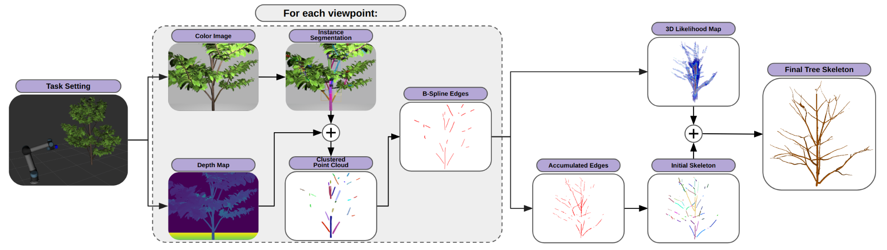
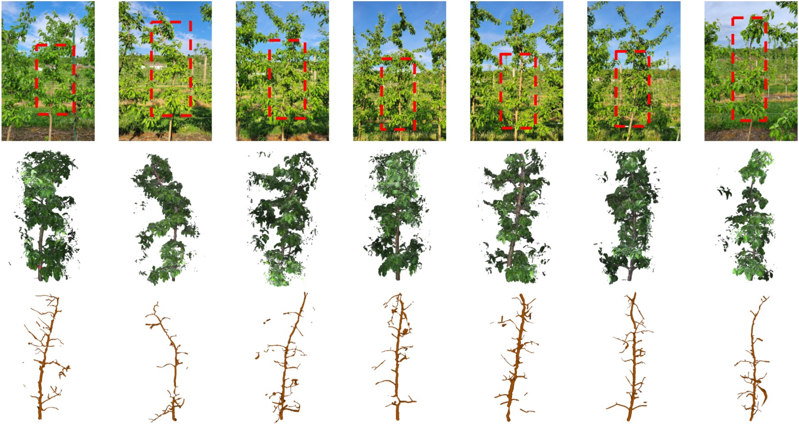

# Occlusion Reasoning for Skeleton Extraction of Self-Occluded Tree Canopies

## 1. Overview
This package implements the perception pipeline for tree canopy skeletonization as presented in our [paper](https://arxiv.org/pdf/2301.08387). Our method extracts the skeleton of a self-occluded tree canopy by estimating the unobserved structures of the tree. We use an instance segmentation network to detect visible trunks, branches, and twigs. Based on the observed tree structures, we build a custom 3D likelihood map in the form of an occupancy grid to hypothesize the presence of occluded skeletons through a series of minimum cost path searches.




### Results: Skeletonizing Apple Trees



### Published Article 
C. H. Kim and G. Kantor, "[Occlusion Reasoning for Skeleton Extraction of Self-Occluded Tree Canopies](https://ieeexplore.ieee.org/document/10160650)," 2023 IEEE International Conference on Robotics and Automation (ICRA), London, United Kingdom, 2023, pp. 9580-9586.
```
@INPROCEEDINGS{10160650,
  author={Kim, Chung Hee and Kantor, George},
  booktitle={2023 IEEE International Conference on Robotics and Automation (ICRA)}, 
  title={Occlusion Reasoning for Skeleton Extraction of Self-Occluded Tree Canopies}, 
  year={2023},
  volume={},
  number={},
  pages={9580-9586},
  keywords={Geometry;Three-dimensional displays;Runtime;Heuristic algorithms;Dynamics;Vegetation;Skeleton},
  doi={10.1109/ICRA48891.2023.10160650}}
```

## 2. 🛠️ Installation
Tested on Ubuntu 22.04

Install with conda:
```bash
conda env create -f conda_environment.yaml
```
Activate environment:
```
conda activate tree_skeleton
```

## 3.1 Downloading sample dataset
A sample dataset for testing the skeletonization pipeline can be downloaded from this [link](https://drive.google.com/file/d/1Azi1HRB0uzJeeKebcOPIX2NTR6tD7nb6/view?usp=drive_link). The sample data is a numpy `.npy` file that contains RGB images, disparity maps, and camera extrinsic and intrinsic parameters of an apple tree taken from 71 different viewpoints. Place the `.npy` file in the repository after downloading.

## 3.2 Downloading model weights
The model weight for branch instance segmentation can be downloaded from this [link](https://drive.google.com/file/d/1AnUm_g4fXUemWWTPcU7GW6ZdnmgqujFt/view?usp=drive_link). Once you donwload it, place it in the repository as follows:
```
tree_skeletonization/model_weights/detectron_branch_segmentation.pth
```

## 4. Running the vision pipeline

1. **Preprocess the Dataset**: This step outputs a `.npy` file containing preprocessed data to be used in the subsequent step.
```bash
python 1_preprocess.py
```
```
Usage: 1_preprocess.py [OPTIONS]

Options:
  --data_npy   TEXT     Path to the npy file containing the data
  --voxel_size FLOAT    Voxel size of the likelihood map (default: 0.002)
```

2. **Run the Skeletonization**: This step takes as input the preprocessed .npy file.
```bash
python 2_skeletonize.py
```
```
Usage: 2_skeletonize.py [OPTIONS]

Options:
  --data_npy   TEXT     Path to the npy file containing the preprocessed data
```
If successfully run, it will output 4 `.ply` files which you can view with a 3D visualizer like MeshLab:

- `likelihood.ply`: The likelihood voxel grid visualized as a point cloud.
- `observed.ply`: The point cloud of observed branches.
- `predicted.ply`: The predicted skeleton.
- `sphere_tree.ply`: Predicted skeleton with added volume using node radius.

## 5. 🏷️ License
This repository is released under the MIT license. See [LICENSE](./LICENSE) for additional details.


## 6. Code contributed and maintained by:
- John Kim: [chunghek@andrew.cmu.edu]()

## Notes for improvement:
Computation bottlenecks:

1. ```cluster_dbscan``` in ```1_preprocess.py```
2. ```fitting.approximate_curve``` in ```edge_extractor.py``` 